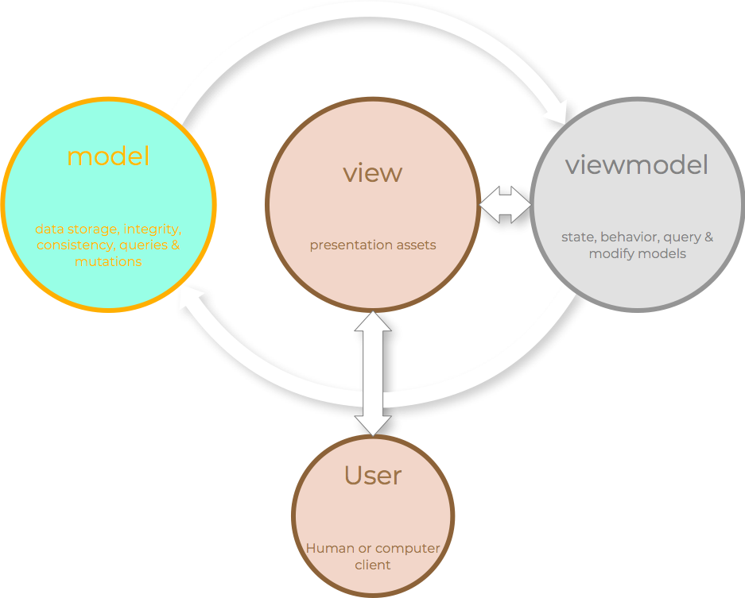
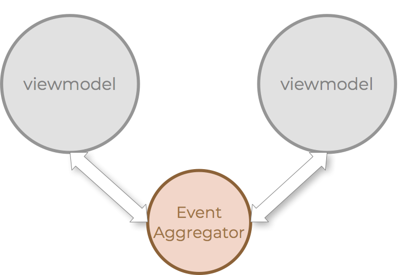

This page talks about the core principles at play, our mindset going into
this project and what is expected from any contributions to the project.

## Target scenario(s)

This library is meant to make it easier to build line of business types of
applications. It is not optimized for other scenarios, although it might
be useful and work fine in other scenarios. With LOB as the target, it
means that there is much more of an application thinking going into this
library. Its all about making applications consistent in look and feel
and make applications more maintainable over time.

## Target persona

The typical developer that we're aiming for with the library is looking for
the following:

- Increased productivity
- Reusable components
- Promotes maintainable code
- Consistent and predictable API surface for components
- Consistent look and feel
- **Not having to do nitty and gritty HTML+CSS to make something cool**

## Core Mindset

At the core of Dolittle sits a set of core principles, such as the
[S.O.L.I.D. principles](https://en.wikipedia.org/wiki/SOLID_(object-oriented_design)
and they all applies just as much in this project as any other Dolittle
project. However, there is a high emphasis on two core principles that
we are looking for; [Single Responsibility principle](https://en.wikipedia.org/wiki/Single_responsibility_principle)
and the [Separation of Concerns princple](https://en.wikipedia.org/wiki/Separation_of_concerns).

These two principles are the core guiding principles throughout all the
code and are on the checklist for reviewers of pull requests.

## Consistency

Making something look consistent and feel solid from a UI perspective is very hard.
We've chosen to lean on existing work from Microsoft Fluent Design System to help
us stay consistent.

## Cohesion

Cohesion is very important; everything that belongs together should go together.
Separating on technical function is considered at Dolittle as an anti-pattern,
so folders that group things by their technical function is not accepted.
A component should have all of its concerns in the same folder; view, styles,
images, view-model or any other resource that is for the component. That also
includes any child component that is to be used for a particular component.
Any helpers that are related to it should also go in the same folder as the
component.

The exception to this rule is when you have something that is commonly used
amongst them.

## One and once only (DRY principle)

## UWP controls as reference

## Design Language

## API thinking

## Encapsulation

## Decoupling

## Separation

## Model View View Model (MVVM)

MVVM originates from [Martin Fowler's](https://martinfowler.com)
[Presentation Model](https://martinfowler.com/eaaDev/PresentationModel.html)
from 2004 and is a variation of Trygve Reenskaug's MVC from 1976.
Microsoft iterated on this and [introduced MVVM in 2005](https://blogs.msdn.microsoft.com/johngossman/2005/10/08/introduction-to-modelviewviewmodel-pattern-for-building-wpf-apps/).



### Model

A model holds state, often served from the server - but not always. It can also
be state created in the client itself. The view model typically provides the model.

### View

The view is responsible for doing the composition of flow, styles and observing
state provided by a view model. It also delegates behaviors back to the view model.

### View Model

The View model is responsible for coordinating the model, expose state and provide
behaviors that can be used by a view. The view model should be completely coupled
from the view and have no explicit knowledge about that it is being used in a view.
Your view model should stay clean.

{}
It is considered an anti-pattern to take a dependency to en `Element` into a view-model.
If you need to interact with the actual element or the DOM in general, you should use
the `@processContent` decorator in Aurelia - read more [here](https://aurelia.io/docs/templating/custom-elements#decorators-for-customizing-aurelia-custom-element-processing).

You can encapsulate the `@processContent` decorator to make it clearer in the code by
introducing a wrapper decorator:

```javascript
import { processContent } from 'aurelia-framework';

export function myDecorator() {
  function myProcessor(viewCompiler, viewResources, element, parentInstruction) {
    /* ...do stuff... */
  }

  return processContent(myProcessor);
}
```

You'd then use it as follows:

```javascript
@myDecorator()
export class viewModel {
}
```

{}

### Values - anti corruption

The view in a Web application typically knows about HTML and strings, some times these
are even so view specific that it really does not make sense for the view model to
interact with it. This is part of really separating the concerns and understanding that
a representation of something in one concern does not have to bleed into another concern.
This is where value converters come to play. They help you translate the value between
the view and view model concerns and make both of these pure in nature.

As a core principle we want to do the translation for the concern as late as possible.
It would be fundamentally wrong to for instance let the backend know how to translate into
something the frontend could be using. The same relationship is between the view and the
view model. The separation in thinking is absolute.

### Event Aggregator

Some times there are multiple parts of a composition of components that need to know of
changes or events that occurs without having to couple them together. This is where an
[event aggregator](https://www.martinfowler.com/eaaDev/EventAggregator.html) comes handy
and lets each component fire and forget messages that others can listen to.



### Composition through binding

Another way to deal with composing multiple components together without using an
event aggregator is to leverage binding and expose an API surface with properties
and observables that will notify when internals are changing of a component.
An example of this could be a component with items in it and you have another component
that will show the details when something is selected. Instead of firing off messages,
you could simply expose an `@bindable` property of the component with items called
`selectedItem`. The details component could then be bound to this items property.
This is called a `ref` binding in Aurelia.

Example:

```html
<template>

  <div>
    <items name="items" view-model.ref="items"></items>
  </div>
  <div>
    <detail-view current-item.bind="items.selectedItem"></detail-view>
  </div>
</template>
```

## Testing

## Debuggability

When developing it is very important that developers get to see what is going on.
Therefor, the use of the `@containerless` decorator is prohibited.

{}
We are however looking into the ability to add this decorator, or the effect of
it as part of a production build. During development it gives a lot more context
to see the actual elements and it helps understand the object model.

You can find the issue [here](https://github.com/dolittle-interaction/JavaScript.Components.Aurelia/issues/7).
{}

## Aurelia building blocks

| Name | Description | Link |
| ---- | ----------- | ---- |
| `@processContent` | Enables you to interact with the DOM | [link](https://aurelia.io/docs/templating/custom-elements#decorators-for-customizing-aurelia-custom-element-processing) |
| ref binding | Element reference binding | [link](https://aurelia.io/docs/binding/basics#referencing-elements) |
